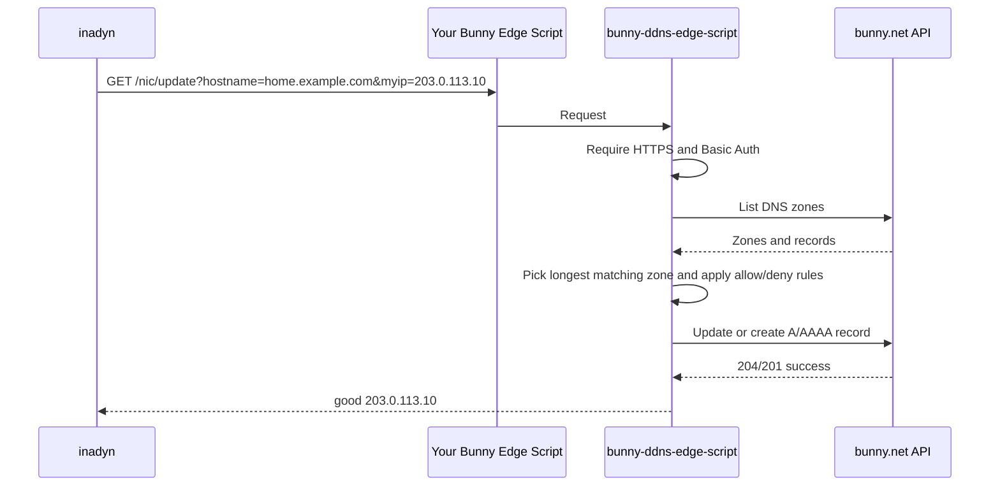

# bunny-edge-scripts

A Deno-first monorepo for secure bunny.net Edge Script building blocks,
published to JSR and npm.

Install it in your own Bunny Edge Script Git repository, connect that repository
to a Standalone Edge Script, and your inadyn/router/NAS clients can update Bunny
DNS records without ever receiving your Bunny API key.

## Why

Dynamic DNS clients usually need a provider credential. For Bunny DNS, the
credential with enough power to update records is your Bunny account API key.
This package keeps that key inside Bunny Edge Scripting as a secret and gives
clients a separate DDNS secret with optional hostname/zone guardrails.

## Distribution

This monorepo publishes three packages:

- `@zimme/bunny-ddns-edge-script` on JSR and npm.
- `@zimme/bunny-tunnel-edge-script` on JSR and npm.
- `@zimme/create-bunny-ddns` on JSR and npm.

The Bunny deployment repo generated by this project is Deno-only by default and
treats the bundled `generated/script.ts` output as a deployment artifact. That
keeps consumer repos readable while still supporting Bunny's Git integration,
GitHub Actions, and manual paste-to-editor deployment.

WASM is intentionally not the primary distribution: this workload is dominated
by request validation and Bunny API calls, so a JS/TS package is simpler and
fits Bunny Edge Scripting directly.

Bunny Edge Scripting itself runs TypeScript directly on a Deno-based runtime, so
a bundler is not inherently required. The remaining bundler step in this repo
exists only to turn the example package-based entrypoint into one self-contained
script file for deploy paths that upload a single script.

## Install

To create a personal deployment repo, use the scaffold generator:

```sh
deno create jsr:@zimme/create-bunny-ddns my-bunny-ddns
```

The npm compatibility entrypoint also works:

```sh
npm exec @zimme/create-bunny-ddns
```

With npm's initializer shorthand, the generator is also available as:

```sh
npm init @zimme/bunny-ddns
```

The generator asks for non-secret setup choices, resolves dependencies, creates
a `deno.lock`, and writes instructions for adding runtime secrets in Bunny Edge
Scripting. It does not write your Bunny API key, DDNS shared secret, deploy key,
or other credentials into generated files.

## Manual Install

In your Bunny Edge Script repository:

```sh
deno add jsr:@zimme/bunny-ddns-edge-script
```

npm compatibility is also available:

```sh
deno add npm:@zimme/bunny-ddns-edge-script
```

Then create `script.ts`:

```ts
import * as BunnySDK from "@bunny.net/edgescript-sdk";
import {
  createBunnyDdnsHandler,
  readBunnyDdnsConfigFromEnv,
} from "@zimme/bunny-ddns-edge-script";

const config = readBunnyDdnsConfigFromEnv({
  get(name: string) {
    return Deno.env.get(name);
  },
});

BunnySDK.net.http.serve(createBunnyDdnsHandler({ config }));
```

See [examples/edge-script-repo](examples/edge-script-repo) for a complete
minimal repo shape.

## Bunny Git Deployment

Bunny's Git integration supports install, build, and entry-file settings. A good
setup for a repo using this package is:

| Setting         | Value                   |
| --------------- | ----------------------- |
| Install command | `deno install --frozen` |
| Build command   | `deno task build`       |
| Entry file      | `generated/script.ts`   |

If your script is already self-contained, Bunny can deploy `script.ts` directly
and you can skip the bundle step entirely. The package-based setup in this repo
still builds `generated/script.ts` because Bunny's deploy surfaces ultimately
upload one script file, not an npm dependency tree.

Example `deno.json`:

```json
{
  "imports": {
    "@zimme/bunny-ddns-edge-script": "jsr:@zimme/bunny-ddns-edge-script@^1.0.0"
  },
  "tasks": {
    "build": "deno bundle --external @bunny.net/edgescript-sdk script.ts -o generated/script.ts && deno fmt generated/script.ts"
  }
}
```

That produces one uploadable `generated/script.ts` file while keeping your
source repo tiny and readable.

If you prefer the GitHub Action deployment path, use Bunny's
`BunnyWay/actions/deploy-script` action after the same build step and set
`file: generated/script.ts`.

For a no-bundle workflow, point Bunny's GitHub Action or Git integration entry
file directly at `script.ts`, but only if that file already contains everything
needed at runtime.

If you prefer manual editor deployment, build the same file and paste
`generated/script.ts` into Bunny's script editor. The generated file is a deploy
artifact, not the place to maintain your source.

The official bunny.net CLI can also link a local deployment repo, deploy the
built bundle, and manage variables and secrets directly in Bunny:

```sh
bunny login
bunny scripts link
deno task build
bunny scripts deploy generated/script.ts
```

Keep the CLI's local `.bunny/` directory out of source control.

## What It Provides

### DDNS

- Secure DynDNS-style update endpoint: `GET /nic/update`.
- Alias endpoint: `GET /update`.
- Check-IP endpoints: `GET /checkip`, `GET /nic/checkip`, `GET /ip`.
- HTTP Basic Auth only. Query-string credentials are rejected.
- HTTPS required by default.
- Account-wide Bunny DNS zone discovery by default.
- Optional allow and deny lists for hostnames and zones. Deny always wins.
- Automatic creation of missing `A` and `AAAA` records by default.
- Safe default for existing Bunny DNS record sets: ambiguous multi-record
  hostnames are rejected unless you explicitly opt in to updating all records.

### Tunnel Edge

`@zimme/bunny-tunnel-edge-script` provides the Bunny Edge Script side of an HTTP
access gateway:

- Route edge requests to one or more configured HTTPS origins.
- Require HTTPS for viewers and origins by default.
- Require viewer `Authorization: Bearer <token>` unless public access is
  explicitly enabled.
- Optionally sign every origin request with `TUNNEL_ORIGIN_SHARED_SECRET` so the
  origin can reject traffic that did not pass through your Bunny script.
- Bind signed requests to the destination origin and reject replayed nonces.
- Strip hop-by-hop headers and viewer `Authorization` before origin forwarding.
- Bound buffered request bodies to 10 MiB by default.
- Add forwarding metadata such as `x-forwarded-host`, `x-forwarded-proto`, and
  `x-forwarded-uri`.
- Serve a local health check at `/__bunny_tunnel/healthz`.

This is intentionally not a full private cloudflared or Tailscale replacement
yet. If an origin is not reachable from Bunny's edge, a future connector/agent
package would still be needed. The package is useful today for public or
allow-listed origins that should only trust signed requests from the edge.

Manual tunnel entrypoint:

```ts
import * as BunnySDK from "@bunny.net/edgescript-sdk";
import {
  createBunnyTunnelHandler,
  readBunnyTunnelConfigFromEnv,
} from "@zimme/bunny-tunnel-edge-script";

const config = readBunnyTunnelConfigFromEnv({
  get(name: string) {
    return Deno.env.get(name);
  },
});

BunnySDK.net.http.serve(createBunnyTunnelHandler({ config }));
```

See [examples/tunnel-edge-script-repo](examples/tunnel-edge-script-repo) for a
complete minimal tunnel deployment repo shape.

## How It Works



## API

### Update

```text
GET https://<your-script-host>/nic/update?hostname=<fqdn>&myip=<ip>
Authorization: Basic base64(username:ddns-secret)
```

Supported query parameters:

| Parameter  | Description                                              |
| ---------- | -------------------------------------------------------- |
| `hostname` | Required. One FQDN or a comma-separated list of FQDNs.   |
| `myip`     | Explicit primary IP address to publish.                  |
| `myip6`    | Optional additional IPv6 address for dual-stack updates. |
| `ip`       | Compatibility alias for `myip`.                          |

At least one of `myip`, `ip`, or `myip6` is required. The update endpoint does
not infer a mutable target IP from request headers. Use `/checkip` first when a
client needs address discovery.

The endpoint returns DynDNS-style plain text:

| Response     | Meaning                                                                          |
| ------------ | -------------------------------------------------------------------------------- |
| `good <ip>`  | Record was created or changed.                                                   |
| `nochg <ip>` | Record already had that address.                                                 |
| `badauth`    | Missing or invalid Basic Auth credentials.                                       |
| `badagent`   | Insecure transport or unsupported request shape.                                 |
| `badip`      | The supplied IP address is missing, invalid, or conflicting.                     |
| `notfqdn`    | The hostname is not a valid FQDN.                                                |
| `nohost`     | No matching Bunny DNS zone or no record when auto-create is disabled.            |
| `!yours`     | Hostname or zone was blocked by allow/deny configuration.                        |
| `dnserr`     | DNS record state is ambiguous, usually multiple records with the same name/type. |
| `911`        | Bunny API or script-side failure. Retry later.                                   |

For compatibility with DDNS clients, protocol-level responses are returned in
the body. Authentication failures use HTTP 401, transport/method failures use
HTTP errors, and normal DDNS result codes use HTTP 200. For multiple hostnames,
the response has one line per hostname.

### Check IP

```text
GET https://<your-script-host>/checkip
```

This returns the detected client IP as plain text. It does not require
authentication, but it still requires HTTPS unless local insecure mode is
enabled. Use it as the discovery step for clients that cannot determine their
public IP locally.

## Required Bunny Secrets

Configure these on the Bunny Edge Script under Env Configuration. Use Bunny
secrets for sensitive values.

| Name                       | Required | Description                                                                                                                                            |
| -------------------------- | -------- | ------------------------------------------------------------------------------------------------------------------------------------------------------ |
| `BUNNY_API_KEY`            | Yes      | Bunny account API key used by the script to list and mutate DNS records. `BUNNY_ACCESS_KEY` is also accepted.                                          |
| `DDNS_SHARED_SECRET`       | Yes      | Password inadyn sends through HTTP Basic Auth.                                                                                                         |
| `DDNS_SHARED_SECRETS`      | No       | Comma-separated secrets for rotation. Overrides `DDNS_SHARED_SECRET` when set.                                                                         |
| `DDNS_USERNAME`            | No       | Require a specific Basic Auth username. If omitted, any username is accepted when the password is valid.                                               |
| `DDNS_ALLOWED_HOSTS`       | No       | Comma-separated exact or wildcard host patterns, for example `home.example.com,*.home.example.net`. Empty means any hostname in available Bunny zones. |
| `DDNS_DENIED_HOSTS`        | No       | Comma-separated exact or wildcard host patterns. Deny wins.                                                                                            |
| `DDNS_ALLOWED_ZONES`       | No       | Comma-separated zone patterns, for example `example.com,*.example.net`. Empty means any available Bunny zone.                                          |
| `DDNS_DENIED_ZONES`        | No       | Comma-separated zone patterns. Deny wins.                                                                                                              |
| `DDNS_AUTO_CREATE`         | No       | Default `true`. Set `false` to update existing records only.                                                                                           |
| `DDNS_TTL`                 | No       | Default `900`. TTL used for records created by the script.                                                                                             |
| `DDNS_MULTI_RECORD_MODE`   | No       | Default `reject`. Set `update-all` to update every matching record with the same hostname/type.                                                        |
| `DDNS_MAX_HOSTNAMES`       | No       | Default `25`. Maximum hostnames accepted in one update request.                                                                                        |
| `DDNS_MAX_MUTATIONS`       | No       | Default and maximum `40`. Rejects requests that could exceed Bunny's per-request subrequest budget.                                                    |
| `DDNS_RECORD_COMMENT`      | No       | Comment used for newly created DNS records.                                                                                                            |
| `DDNS_ALLOW_INSECURE_HTTP` | No       | Default `false`. Set `true` only for local development.                                                                                                |
| `DDNS_API_BASE_URL`        | No       | Default `https://api.bunny.net`. Mostly useful for tests.                                                                                              |

## Inadyn Example

Replace `ddns.example.com` with the hostname assigned to your Bunny Edge Script.
Inadyn wants server names without `https://`.

```conf
custom bunny-ddns-edge-script {
    username       = "inadyn"
    password       = "use-a-long-random-ddns-secret"

    checkip-server = "ddns.example.com"
    checkip-path   = "/checkip"
    checkip-ssl    = true

    ddns-server    = "ddns.example.com"
    ddns-path      = "/nic/update?hostname=%h&myip=%i"
    ssl            = true

    hostname       = "home.example.com"
}
```

Multiple hostnames can be configured in inadyn as usual:

```conf
hostname = { "home.example.com", "vpn.example.com" }
```

For clients that can send IPv6 directly, use `myip6`:

```text
/nic/update?hostname=home.example.com&myip=203.0.113.10&myip6=2001:db8::10
```

## Library API

```ts
import {
  createBunnyDdnsHandler,
  readBunnyDdnsConfigFromEnv,
} from "@zimme/bunny-ddns-edge-script";
```

Exports:

- `createBunnyDdnsHandler(options)`
- `readBunnyDdnsConfigFromEnv(env)`
- Type exports for `RuntimeConfig`, `HandlerOptions`, `Fetcher`, `EnvReader`,
  and `MultiRecordMode`

The package root intentionally keeps the stable public API small. Helper
functions used internally by the package are not exported from
`@zimme/bunny-ddns-edge-script`.

That packaging choice is also why the example repo still bundles for deployment:
the source `script.ts` imports `@zimme/bunny-ddns-edge-script`, but Bunny's
deployment API and official GitHub Action upload one script file at a time.

## Versioning

This project uses Semantic Versioning and Conventional Commits. All three
packages share one lockstep version. Only pushing a SemVer tag such as `1.0.0`
starts a release. The tagged commit must already contain that exact version in
every manifest. The release workflow validates and publishes that immutable
commit, then generates Conventional Changelog release notes and a complete
changelog asset on GitHub.

See [RELEASING.md](RELEASING.md) for the OIDC trusted-publishing setup and
release checklist.

## Local Development

The supported development environment is the Docker Compose-backed Dev Container
in `.devcontainer/`. Open the repository in VS Code Dev Containers, GitHub
Codespaces, or start it from a host with Docker, Node, and npm. The bootstrap
command downloads the exact Dev Container CLI version when it is not already
installed in the repository:

```sh
npm run devcontainer:up
npm run devcontainer:exec -- npm run validate
npm run devcontainer:down
```

The container pins Deno, Node, npm, GitHub CLI, and GitHub Copilot CLI versions.
Its Dev Container Features are also pinned by
`.devcontainer/devcontainer-lock.json`. Docker Compose currently starts only the
workspace service because the project has no database, queue, or other required
service. Add future dependencies as Compose services so local development and CI
continue to use the same topology.

Inside the container, the normal commands are:

```sh
npm run setup
npm run doctor
npm run fmt
npm run test
npm run validate
```

`npm run validate` is the complete check used by CI. It verifies the pinned
toolchain, performs a frozen dependency install, checks Conventional Commits,
and runs formatting, spelling, agent configuration, linting, typechecking,
tests, builds, smoke checks, dependency audit, and JSR/npm publication dry-runs.
GitHub Actions sets `CI=true`; no separate CI-only script is maintained.

Agent-wide project guidance lives in `AGENTS.md`. Focused workflows use the open
Agent Skills format under `.agents/skills/`, with compatibility shims for GitHub
Copilot, Claude Code, and Gemini CLI. Run `npm run agents:check` to validate
instruction imports, skill metadata, UI metadata, and skill-directory symlinks.

Host-side Deno commands remain available as a fallback. Use `deno install` when
intentionally updating dependencies and `deno ci` for a frozen install from the
committed lockfile.

`dist/` is generated package output and is gitignored. `deno task build` or the
package `prepack` step refreshes it locally when you need to verify or publish
the npm tarball. The example repo builds
`examples/edge-script-repo/generated/script.ts`, which is only a deployment
artifact.

## Security Defaults

- The Bunny account API key is only stored in the Edge Script environment.
- DDNS clients authenticate with a separate shared secret.
- HTTPS is required unless `DDNS_ALLOW_INSECURE_HTTP=true`.
- Passwords in query strings are rejected.
- Update requests only use explicit IP query parameters, never forwarding
  headers, to choose the DNS target.
- Deny lists override allow lists.
- Missing records are created only when `DDNS_AUTO_CREATE=true`.
- Multiple existing records for the same hostname and IP family are rejected by
  default. This avoids accidentally flattening a Bunny DNS weighted or smart
  record set into one dynamic address.
- Mutation requests are preflighted against Bunny Edge Scripting's 50 subrequest
  limit before any DNS record is changed.

This project does not implement DNS TXT proof by default. The script already has
the Bunny API key, so a TXT-token flow adds setup work without meaningfully
reducing the risk for the normal single-owner account case. For delegation,
prefer `DDNS_ALLOWED_HOSTS`, `DDNS_ALLOWED_ZONES`, or separate script instances
with different secrets.

## References

- [bunny.net Edge Scripting overview](https://docs.bunny.net/scripting)
- [bunny.net GitHub integration](https://docs.bunny.net/scripting/github-integration)
- [bunny.net Edge Script secrets](https://docs.bunny.net/scripting/secrets)
- [bunny.net Edge Script limits](https://docs.bunny.net/scripting/limits)
- [bunny.net CLI for Edge Scripts](https://bunny.net/blog/build-and-deploy-scripts-at-the-edge-with-the-bunny-net-cli/)
- [Deno create templates](https://docs.deno.com/runtime/reference/cli/create/)
- [Development Containers](https://containers.dev/)
- [Dev Containers in CI](https://github.com/devcontainers/ci)
- [GitHub Copilot coding-agent environment setup](https://docs.github.com/en/copilot/how-tos/copilot-on-github/customize-copilot/customize-cloud-agent/customize-the-agent-environment)
- [bunny.net DNS Zone API](https://docs.bunny.net/api-reference/core/dns-zone/list-dns-zones)
- [inadyn custom DDNS providers](https://github.com/troglobit/inadyn)

## License

MIT
